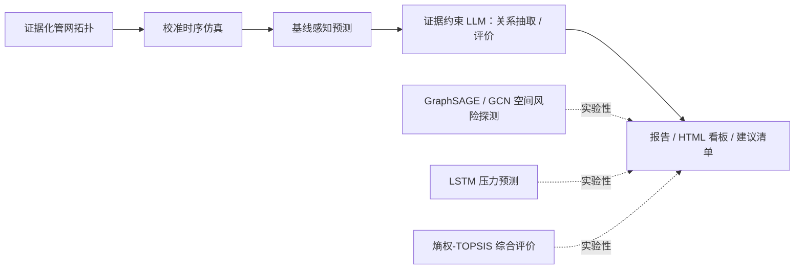

# 智慧水务综合管理Agent系统


一个面向供水管网韧性分析的公开示例 Agent。系统把管网拓扑、运行时序、风险关系、证据约束分析与可视化串成一条可复现的分析流水线，并提供命令行、Python API、HTML 看板和 Open WebUI 适配示例。

> GitHub 仓库的 URL 使用 ASCII slug：`zhihui-shuiwu-zonghe-guanli-agent-xitong`；中文项目名保留在本 README、配置和页面标题中。

## 功能概览



主要能力：

- 生成可控随机种子的抽象供水管网拓扑，计算节点和管段风险特征（证据化拓扑基础）。
- 对压力、流量、余氯、维修和管理记录进行合成仿真与校准（calibrated time-series）。
- **基线感知预测**：以持续 / MA / AR 等简单基线为参照，通过部署门复检 LSTM 是否已超越周季节基线；当前统一预测协议下 LSTM 未超越 WeeklySN 基线，故不作为正式预测主链。
- 构建“风险因素—影响对象—风险后果—处置措施”关系，并保留关系来源与人工核验状态（证据约束 LLM 抽取，默认关闭）。
- 根据抵御、吸收、恢复、适应四个维度计算指标矩阵；熵权-TOPSIS 作为敏感性感知的评分参考，但其当前证据不足以支撑正式分区结论。
- 查询高风险节点、模型指标、拓扑摘要和建议性维修清单。
- 真实数据接入与校准（可选）：公开基准管网（肯塔基 ky10 等 EPANET .inp）ETL、部署侧监测数据接入与仿真校准、LSTM 部署门槛复核。真实数据仅存放于部署侧（`data/real/` 已被 .gitignore 排除），不随仓库分发。

### 模块定位：Exploratory / Demonstration

仓库保留 GraphSAGE/GCN、LSTM、熵权-TOPSIS 的完整代码（`water_resilience/src/models/gnn_train.py`、`models/lstm_forecaster.py`、`evaluation/entropy_topsis.py`），用于方法验证与后续研究；它们**不**对外声称产出为正式工程结论。

| 模块 | 当前定位 | 实验性模块结论 |
| --- | --- | --- |
| GraphSAGE / GCN 空间风险识别 | 实验性 / 演示 | 当前证据不足以支撑正式空间风险结论 |
| LSTM 压力预测 | 实验性 / 演示 | 统一预测协议下未超越 WeeklySN 周季节基线（MAE 约为基线 5–10 倍），不进入正式主链 |
| 熵权-TOPSIS 综合评价 | 实验性 / 演示 | 权重敏感性已分析，但作为正式分区 / 周期结论的证据仍不足 |

## 数据与安全边界

本仓库是可公开发布的功能示例，默认输入均为合成数据。公开版不包含：

- 真实管网、监测、维修或管理数据（仓库仅提供真实数据 ETL/校准脚本，数据本身由部署侧提供）；
- 数据集、上传文件、数据库、缓存和运行日志；
- 论文、申报材料、研究笔记或内部文档；
- 任何模型权重、服务器路径、隧道配置、密钥和私有接口；
- 生产调度、阀门控制或真实维修派单能力。

风险关系的 LLM 抽取是可选演示能力，默认关闭。接入自己的数据或模型前，请先确认授权、脱敏和本地存储边界。系统输出用于功能演示和方法验证，不应直接作为生产决策依据。

## 快速开始

建议使用 Python 3.10+：

```bash
python -m venv .venv
# Windows
.venv\Scripts\activate
# Linux/macOS
# source .venv/bin/activate
pip install -r requirements.txt

# 运行完整的离线合成数据流水线
python water_resilience/src/pipeline.py

# 生成并查看本地 HTML 看板
python water_resilience/app/dashboard.py --no-serve
python water_resilience/app/dashboard.py
```

流水线产物写入 `water_resilience/outputs/`，合成中间数据写入 `water_resilience/data/generated/` 和 `water_resilience/data/extracted/`；这些目录默认被 `.gitignore` 排除。

## Python API

```python
from agent import WaterManagementAgent

agent = WaterManagementAgent()
print(agent.capabilities())
agent.run_analysis()
print(agent.get_resilience_scores())
print(agent.generate_work_orders())  # 仅建议，不会执行外部操作
```

也可以使用轻量级中文路由：

```bash
python -m agent "查看高风险节点"
python -m agent "查看综合韧性评分"
```

## Open WebUI 适配

`integrations/openwebui/water_agent_tool.py` 提供最小 Functions 风格适配层，包含：

- `run_water_analysis`：默认运行离线合成数据流水线；
- `query_water_agent`：查询风险、韧性、拓扑、模型或建议性维修清单；
- `get_water_capabilities`：查看能力和数据边界。

适配层只访问本仓库的公开输出目录，不包含服务器地址、认证信息或生产控制逻辑。

## 项目结构

```text
agent/                         # Python Agent API 与命令行入口
integrations/openwebui/        # Open WebUI 适配示例
water_resilience/config/       # 合成演示配置与指标体系
water_resilience/src/          # 拓扑、仿真、基线感知预测、评价与报告流水线（含 GNN/LSTM/TOPSIS 等实验性模块、真实数据 ETL/校准与 LSTM 部署门槛复核脚本）
water_resilience/app/          # 本地 HTML 看板服务
tests/                         # 公开边界和基础结构检查
```

## 商用与授权说明

- 本仓库全部自研代码，采用 **商用授权协议** 发布（见根目录 [LICENSE](LICENSE)）：阅读、学习与本地演示免费；复制、修改、再分发与商用需事先取得书面授权。
- 项目依赖（PyTorch、scikit-learn、networkx 等）各有独立开源许可证，使用时需分别满足其条款。
- 本仓库为合成数据功能示例，不包含任何真实管网数据与生产控制能力；若面向水务行业商用交付，应自行接入合规数据并完成数据安全与行业规范审查，系统输出不应直接作为生产决策依据。

## 许可证

商用授权协议（Commercial License），详见 [LICENSE](LICENSE)。商用请联系维护者取得书面授权。
